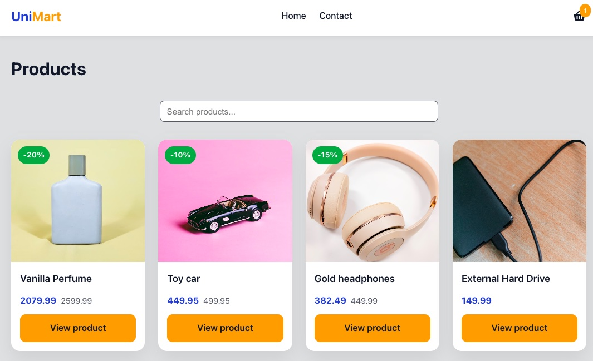

# UniMart



A modern e-commerce web application where users can browse products, manage a shopping cart, and complete a checkout process.

## Description

UniMart is a Course Assignment for JavaScript Frameworks as part of the Front-end Development studies at Noroff.

The project is a React-based online store that allows users to browse products, view detailed product information, add items to a shopping cart, and complete a checkout flow.

The application includes:

- Product listing and product detail pages
- Discount badge for discounted products
- Add and remove products from the shopping cart
- Cart count displayed in the navigation bar
- Checkout flow with success confirmation
- Automatic cart clearing after successful checkout
- Contact form with validation
- Responsive design for mobile, tablet and desktop.
- Custom "Route Not Found" error page

## Built With

- React (Create React App)
- JavaScript
- CSS
- React Router
- Noroff API v2

## Hosted Site

[Live Demo](https://jsfw-veronika.netlify.app/)

## Getting started

### Installing

1. Clone the repository:

```bash
git clone git@github.com:NoroffFEU/jsfw-2025-v1-veronika-jsfw.git
```

2. Install the dependencies:

```bash
npm install
```

### Running

To run the application locally:

```bash
npm start
```

### Build for Production

To create a production build:

```bash
npm run build
```

## Contact

[My LinkedIn profile](https://www.linkedin.com/in/veronika-reinhaug/)
